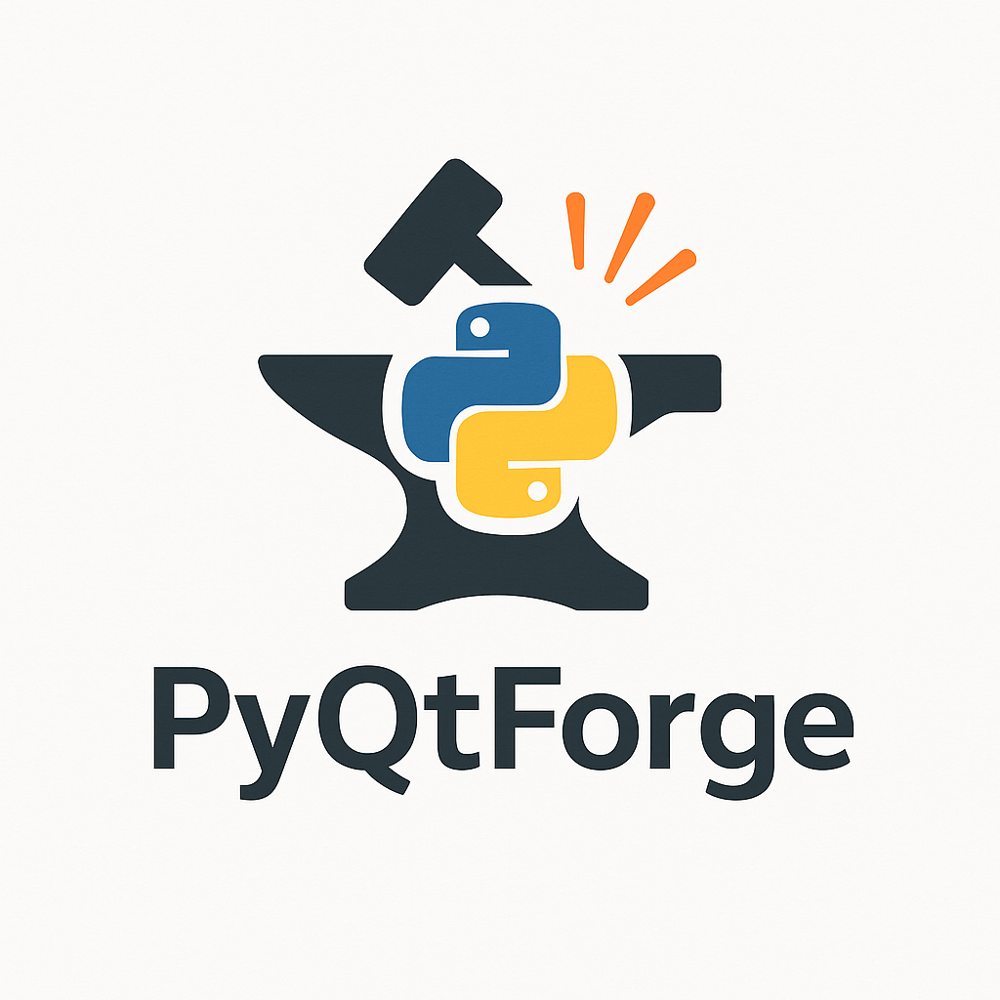
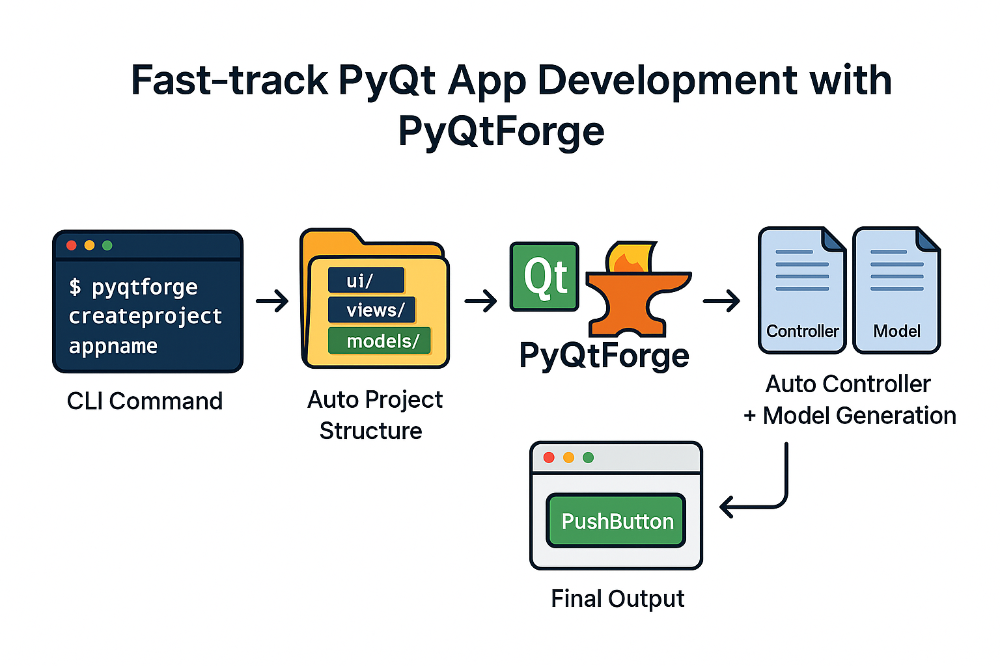

# PyQtForge 🔥

PyQtForge is a lightweight and powerful CLI framework designed to accelerate PyQt5 desktop app development. It brings the structure of modern web frameworks like Django to the world of Python desktop applications.




---

## ✨ Key Features

- ⚡ Fast project scaffolding with `createproject`
- 🧱 Structured MVC-like pattern using `views`, `controllers`, and `models`
- 🎨 Integrates Qt Designer (`.ui`) with auto-conversion to Python
- ⚙️ Controller generation with `mkctrl`
- 🧩 ORM-friendly design with `initdb` and `models.py`
- 📦 Virtualenv support and package installer
- 📂 Clean and extensible file structure
- 🚀 Ready for PyInstaller packaging

---

## 📦 Installation

```bash
pip install pyqtforge
git clone https://github.com/tusharNova/pyqtforge
cd pyqtforge
pip install -e .
```

## 🔧 CLI Usage
```bash
pyqtforge createproject MyApp         # Creates a new PyQt project
cd MyApp

pyqtforge createui MainWindow         # Launch Qt Designer
pyqtforge ui2py --all                 # Convert all .ui to .py

pyqtforge mkctrl MainWindow          # Create controller for MainWindow.ui
pyqtforge initdb                     # Set up config/ and models/ for ORM
pyqtforge runproject MyApp           # Run your project
pyqtforge mkmodel user                # create user model
```

## 🧠 Project Structure
```bash
MyApp/
│
├── main.py
├── ui/              # Qt Designer .ui files
├── views/           # Converted .py files from UI
├── controllers/     # Controller classes (ClsMainWindow, etc.)
├── models/          # ORM-style models
├── config/          # DB connection settings
├── .venv/           # Optional virtual environment
└── ...
```

## 🔍 Vision
### PyQtForge is inspired by the productivity of Django but tailored for desktop apps. The goal is to build:
- 🔌 Database-aware PyQt projects

- 📊 Model support with ORM-like patterns

- ⚒️ Scalable command system (mkctrl, initdb, etc.)

- 📦 Easy packaging with PyInstaller

- 🌍 Community-driven extensions and plugins

## 🤝 Contributing
We welcome all contributors! See CONTRIBUTING.md (coming soon) or open an issue/discussion to share ideas.

## 📜 License

MIT License — see LICENSE file.